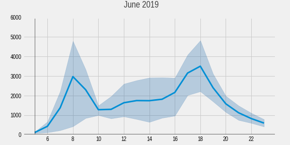
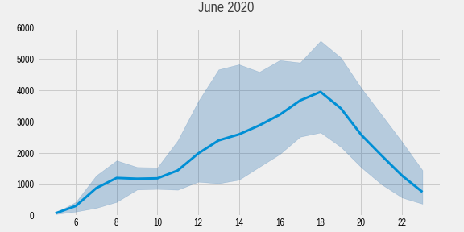
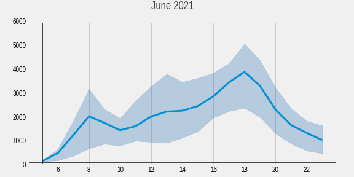
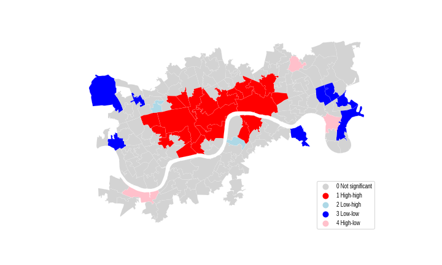

# Human mobility in response to COVID-19: a study of weekend travel demand in London

The repo contains the code used for my MSc dissertation at CASA UCL. 

In this research I tried to understand which factors influenced bus and bike sharing ridership before and during COVID in London. To do so, I used a spatial lag regression model to perform a trip generation analysis from the so called four-step model conventionally used in transport analysis. 

Three time periods were used to evaluate the change: 
* June 2019 for pre-pandemic mobility,
* June 2020 for lockdown mobility,
* June 2021 for lockdown easing period. 

I aggregated bus passenger data requested from TfL and London’s Cycle Hire Scheme usage data publicly available at TfL DataStore. The study area was additionally narrowed to 154 MSOAs to capture two modes of transportation as cycle hire is only available in certain Zones 1 and 2 locations.

Data analysis consisted of 3 stages.

1. Temporal and spatial patterns of trips

This part includes:
– time series plots with hourly change of average trips counts for buses and bicycles,
– trips counts separated by days of week,
– map with trip distributions.

Full code: [2_bus_data_spatiotemp.ipynb](2_bus_data_spatiotemp.ipynb) and [2_cycling_data_spatiotemp.ipynb](2_cycling_data_spatiotemp.ipynb).

Below is an example of results showing mean daily amount of cycle hire trips by day of the week for 3 study periods. It illustrates that in 2020 morning weekday peaks disappeared completely and cycling weekend demand managed to outperform not only the weekday volumes at that period, but even pre-COVID weekday volumes. The 2021 weekend levels almost did not changed in comparison with 2020 which might indicate the potential long-term endurance of this demand.

  
  
  

2. Spatial autocorrelation 

Local indicators of spatial association (LISA) were used to measure spatial dependance using the queen criterion of contiguity. Hot and cold spot analysis was done. 

Full code: [3_spatial_autocorrelation.ipynb](3_spatial_autocorrelation.ipynb)

The LISA analysis for bikes demonstrated that during lockdown cold spots at underused Eastern docks disappeared, possibly indicating a smoother distribution of trip arrivals and an increased propensity to travel to a variety of localities. However the cold spot reemerged in 2021. 

  
  
  

3. Spatial regression

First, several variables which need a lot of data wrangling are aggregated in separate notebooks: [1_occupancy_data_munging.ipynb](1_occupancy_data_munging.ipynb), [1_street_network_munging.ipynb](1_street_network_munging.ipynb). 
Then all variables are combined in [4_prepare_independent_vars.ipynb](4_prepare_independent_vars.ipynb)
Finally, regressions are run in [5_regression_models.ipynb](5_regression_models.ipynb).

